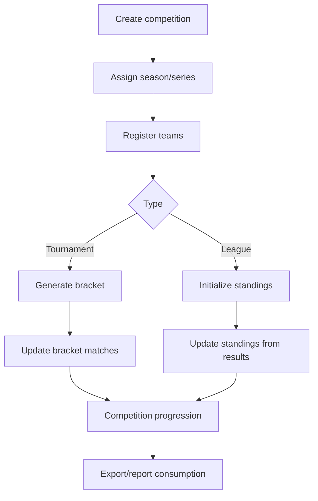
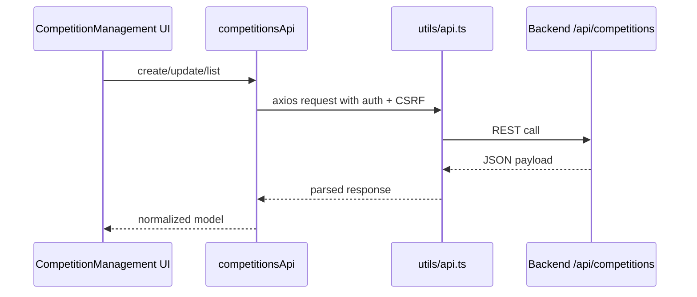

# Competition Management

This document describes the competition-management feature set and the API client methods that power it.

## 1. Feature Scope

Competition management includes:

- Creating and editing competitions
- Registering/removing teams
- Tournament bracket generation and updates
- League standings initialization and updates
- Linking competition structures to seasons and series/divisions

Primary routes:

- `/competitions`
- `/competitions/:id/bracket`
- `/competitions/:id/standings`
- `/series`

## 2. API Client Methods

### 2.1 competitionsApi (`frontend/src/services/competitionsApi.ts`)

- `list(filters)`
- `getById(id)`
- `create(payload)`
- `update(id, payload)`
- `delete(id)`
- `getTeams(competitionId)`
- `addTeam(competitionId, teamId, options)`
- `removeTeam(competitionId, teamId)`
- `getBracket(competitionId)`
- `generateBracket(competitionId)`
- `updateBracketMatch(competitionId, bracketId, payload)`
- `getStandings(competitionId)`
- `initializeStandings(competitionId)`
- `updateStandings(competitionId, gameId)`
- `updateStandingPoints(competitionId, teamId, points)`

### 2.2 Related data clients

- `clubsApi`: `getAll`, `getById`, `create`, `update`, `delete`, `getTeams`, `getPlayers`
- `seriesApi`: `list`, `getById`, `create`, `update`, `delete`
- `seasonsApi`: `list`

## 3. Competition Lifecycle Diagram

## 4. Data Flow Diagram

## 5. Error And Offline Behavior

- Client surfaces normalized server errors for actionable UI messages
- Write operations can be queued when backend/network is unavailable
- Queued responses return `{ queued: true, message }` where applicable

## 6. Visual References

## 7. Related Guides

- [USER_GUIDE.md](USER_GUIDE.md)
- [NAVIGATION_GUIDE.md](NAVIGATION_GUIDE.md)
- [../frontend/README.md](../frontend/README.md)
