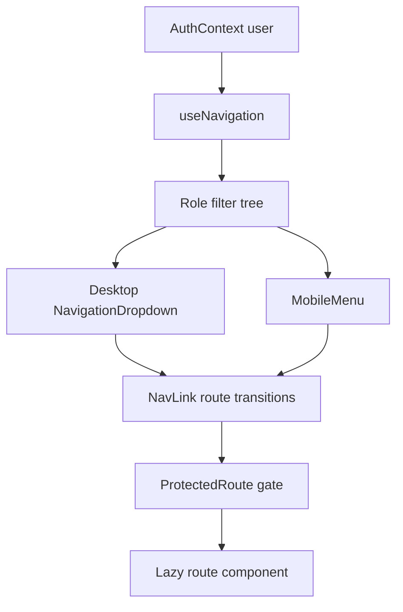

# Navigation Guide

This document covers the navigation architecture, route mapping, role logic, and implementation details.

## 1. Goals

- Reduce cognitive load with grouped navigation categories
- Keep role restrictions centralized and deterministic
- Preserve parity between desktop dropdowns and mobile menu
- Support onboarding/help actions without adding route clutter

## 2. Navigation Tree

Defined in `frontend/src/config/navigation.ts`.

- Dashboard
- Matches
  - All Games
  - Live Match
  - Match Templates
- Analytics
  - Match Analytics
  - Achievements
  - Advanced Analytics
  - Team Analytics
  - UX Observability
- Data
  - Players
  - Teams
  - Clubs
  - Competitions
  - Series/Divisions
- Settings
  - Export Center
  - Report Templates
  - Scheduled Reports
  - Settings
  - Twizzit Integration
  - User Management

## 3. Role Matrix

| Navigation Item | user | coach | admin |
|---|---|---|---|
| Dashboard | Yes | Yes | Yes |
| Matches -> All Games / Live Match | Yes | Yes | Yes |
| Matches -> Match Templates | No | Yes | Yes |
| Analytics -> Match Analytics / Achievements | Yes | Yes | Yes |
| Analytics -> Advanced Analytics / Team Analytics | No | Yes | Yes |
| Analytics -> UX Observability | No | No | Yes |
| Data -> Players / Teams | Yes | Yes | Yes |
| Data -> Clubs / Competitions / Series | No | Yes | Yes |
| Settings -> Export/Reports/Twizzit | No | Yes | Yes |
| Settings -> User Management | No | No | Yes |

## 4. Architecture Diagrams

### 4.1 Navigation rendering flow



### 4.2 Route ownership by category

```mermaid
graph LR
    NAV[Navigation Category] --> M[Matches Routes]
    NAV --> A[Analytics Routes]
    NAV --> D[Data Routes]
    NAV --> S[Settings Routes]

    M --> M1[/games]
    M --> M2[/match/:gameId]
    M --> M3[/templates]

    A --> A1[/analytics/:gameId]
    A --> A2[/advanced-analytics]
    A --> A3[/team-analytics]

    D --> D1[/players]
    D --> D2[/teams]
    D --> D3[/clubs]
    D --> D4[/competitions]
    D --> D5[/series]

    S --> S1[/exports]
    S --> S2[/report-templates]
    S --> S3[/scheduled-reports]
    S --> S4[/settings]
    S --> S5[/twizzit]
    S --> S6[/users]
```

## 5. Component Responsibilities

- `Navigation.tsx`: responsive shell, user dropdown, help/onboarding actions
- `NavigationDropdown.tsx`: grouped menus and active-state presentation
- `MobileMenu.tsx`: touch-first menu behavior
- `useNavigation.ts`: role filtering, divider cleanup, admin badge injection
- `navigation.ts`: declarative source of truth for hierarchy and role access

## 6. API Clients Used By Navigation-Linked Screens

- Competitions and clubs: `competitionsApi`, `clubsApi`, `seriesApi`, `seasonsApi`
- Analytics screens: `advancedAnalyticsApi`, `teamAnalyticsApi`
- Settings/reporting screens: `reportTemplatesApi`, `scheduledReportsApi`, `settingsApi`
- Shared HTTP client behavior: `utils/api.ts` cache helpers, CSRF handling, offline queueing

## 7. Visual References


